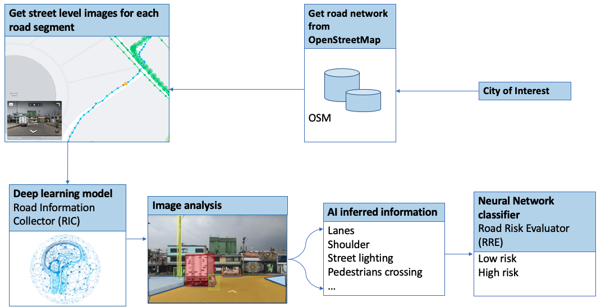

## What is this code for



The user specify a region of interest (ROI) using a boudning box. 
The code will automatically retrieve this ROI's road network from OpenStreetView.
For each road segment, the code will download a street view image by calling the Mapillary API.
The code will then call the image segmentation model, Road Information Collector (RIC), for inferring road characteristics. 
The output will be fed into the Road Risk Evaluator (RRE), a neural network, which will predict the risk level for each road segment for the ROI.

## Installation

```{tip}
Python > 3.6 is required
```

### Download mmdetection into the current folder

```{tip}
git clone https://github.com/open-mmlab/mmdetection.git
```

### Download the trained model from [here](https://drive.google.com/uc?export=download&id=1Por_1B_92_4qjDn67tdP--Sau2DsJC43) and put it in the model folder like this

```{tip}
model/sv1/sv1.pth
```

### Install mmdetection following the instructions [here](https://mmdetection.readthedocs.io/en/v2.19.0/get_started.html)

### Install other requirements

```
pip install -r requirements.txt
```

## Infer road characteristics for a selected region

```
python inferX.py \
-t '{mapillary_client_token}' \
-p '{place_mame}' \
-b '{north west south east}' \
-c 'configs/sv1.py' -ckp 'model/sv1/sv1.pth' \
-f yes
```

* mapillary_client_token: Get your Mapillary Client Token from [here](https://www.mapillary.com/dashboard/developers)
* place_mame: give a name for the region you are interested in
* {north west south east}: defining a bounding box of interest, in logitude and latitude


## Predict risk level

### Download the trained RRE model from [here](https://drive.google.com/uc?export=download&id=1_mO_ZPlEjbHIsbAq6L38Ej1CWDHg-Xv9) and save it in the model floder

```
model/RRE.sav
```

### Run RRE model to predict road risk

```bash
python predict.py -p {place_mame} -b '{north west south east}' -m 'model/RRE.sav'
```

You can change the -p and -b values for different regions. 
Road risk prediction will be saved at 

```
data/{place_mame}/Predictions_final.geojson
```